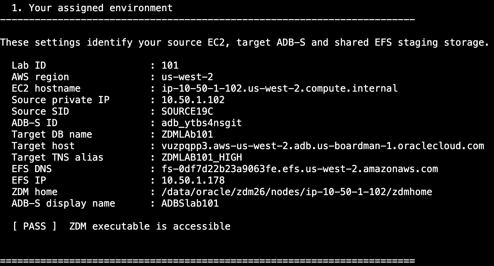
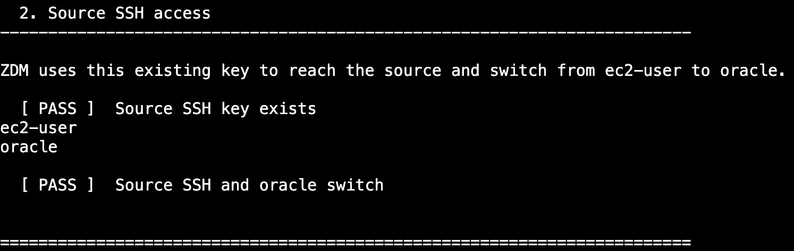
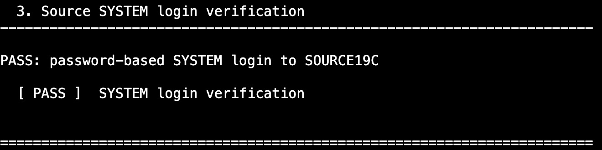
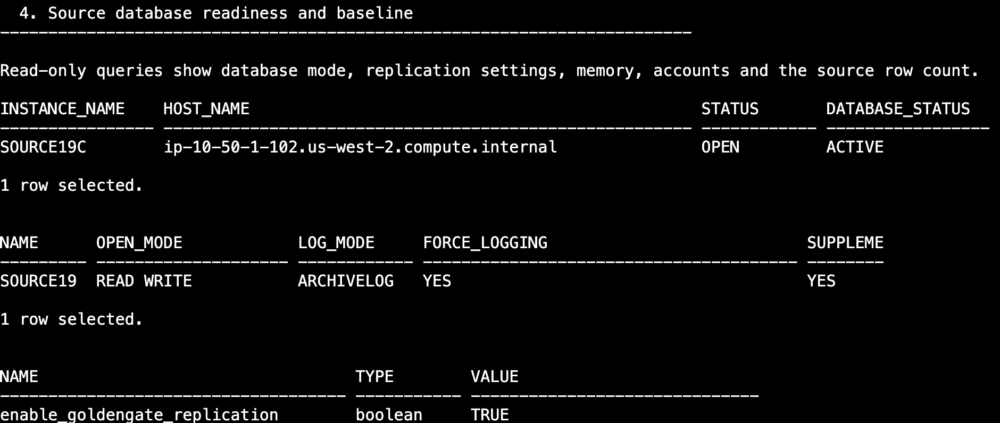
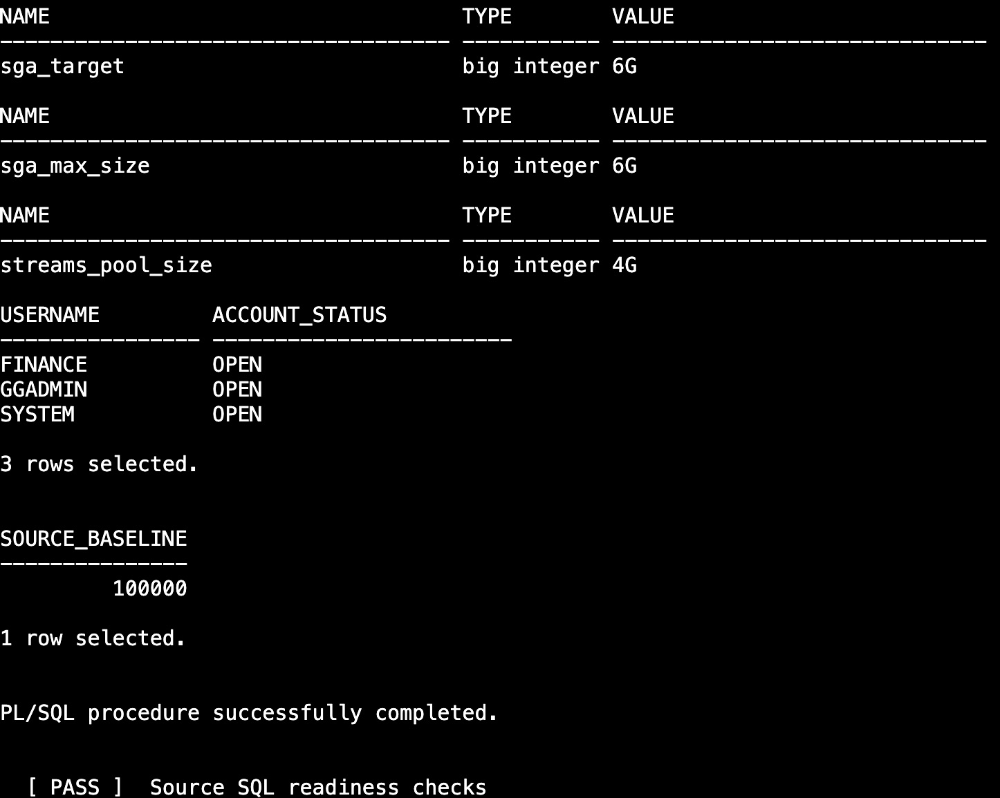
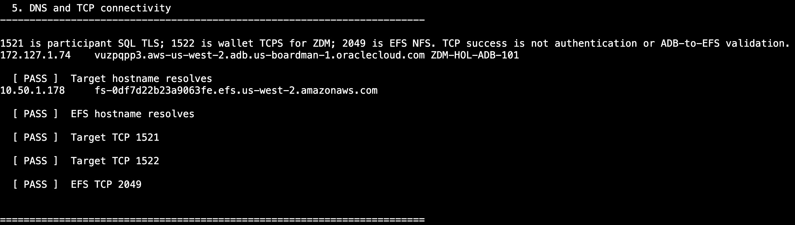
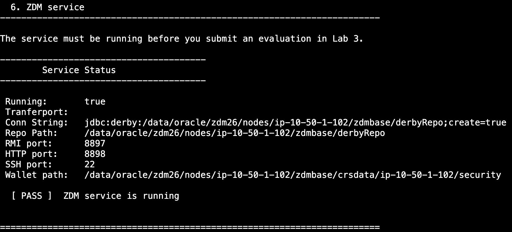
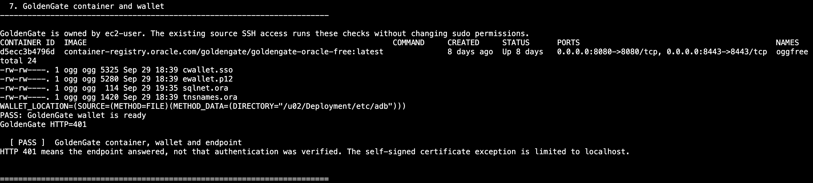
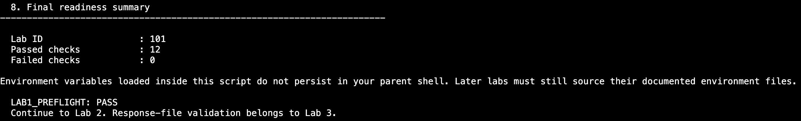

# Lab 1: Confirm the Migration Architecture and Preflight Checks

## Introduction

The source Oracle database and Zero Downtime Migration (ZDM) run on your assigned EC2 instance. Oracle GoldenGate runs in a Podman container on that instance. Data Pump copies the initial data through shared Amazon EFS storage, and GoldenGate captures ongoing changes to keep the target Autonomous Database synchronized.

Run the preflight script once, then review its eight output sections. Each section checks a different part of the migration environment.

Estimated Time: 15 minutes

### Objectives

Connect to your assigned EC2 instance, run the automated checks as `oracle`, and understand the results before starting migration.

## Task 1: Connect Through Session Manager

1. Sign in to the AWS Console and select **US West (Oregon), us-west-2**.

2. Open **EC2 → Instances**, select your assigned instance, and choose **Connect → Session Manager → Connect**. Use Session Manager, not EC2 Instance Connect (SSH).

3. The session opens a Linux shell, normally as `ssm-user`. Switch to the Oracle operating-system user:

    ```bash
    <copy>
    sudo -iu oracle
    </copy>
    ```

4. Confirm your current user:

    ```bash
    <copy>
    whoami
    </copy>
    ```

    Expect `oracle`. Run the following commands in this EC2 shell, not in CloudShell.

## Task 2: Run the Preflight Script

1. Run the script from the Oracle home directory and save its output:

    ```bash
    <copy>
    cd "$HOME"
    umask 077
    set -o pipefail
    bash "$HOME/lab1-preflight.sh" 2>&1 | tee "$HOME/lab1-preflight.log"
    </copy>
    ```

    The script loads the assigned environment and performs the checks automatically. Wait until the shell prompt returns. Do not enter SQL statements or rerun the individual checks while it is running.

2. Check the final summary. Expect `Failed checks : 0` and `LAB1_PREFLIGHT: PASS`. If a check fails, stop before starting migration and identify the failed section.

3. Open the saved output to review it without running the script again:

    ```bash
    <copy>
    less -S "$HOME/lab1-preflight.log"
    </copy>
    ```

    Use the arrow keys or Page Up/Page Down to move through the output. Use the left and right arrows for wide lines. Press `q` to return to the shell.

## Task 3: Validate Each Output Section

Compare the results below with your own output. Resource names, addresses, paths, timestamps, container IDs, and row counts can differ. Check your assigned values rather than copying values from the screenshots.

### Section 1: Your Assigned Environment

This section identifies the source EC2 host, source database, target Autonomous Database, and EFS filesystem. It also checks that the ZDM executable is accessible.

Confirm that the assignment ID, target database name, target TNS alias, and **ADB-S display name** match your assigned resources. The display name identifies the target in the console; the TNS alias is used to connect to it. Check that the source and EFS addresses are populated and that the ZDM executable check passes.

These values connect the migration components to the correct source, target, and shared storage. A mismatch can send a connection or data-transfer operation to the wrong resource.



### Section 2: Source SSH Access

This section checks that the source SSH key exists and that ZDM can use it to connect as `ec2-user` and switch to `oracle` without an interactive password prompt.

Expect both `ec2-user` and `oracle` in the output, followed by `PASS` for source SSH and the Oracle user switch. ZDM needs this access to perform source-side migration operations. Do not continue if the key or user-switch check fails.



### Section 3: Source SYSTEM Login Verification

This section verifies a password-based `SYSTEM` connection to the source database service `SOURCE19C`.

Expect `PASS: password-based SYSTEM login to SOURCE19C` and `PASS` for SYSTEM login verification. This confirms that the source administrative credentials and local listener connection work. ZDM needs a working source administrative account; operating-system access alone does not prove that database authentication succeeds.



### Section 4: Source Database Readiness and Baseline

This section checks the source database state, logging configuration, GoldenGate setting, account status, and initial row count.

First, confirm that the instance is `OPEN` and `ACTIVE`, the database is `READ WRITE`, and `LOG_MODE` is `ARCHIVELOG`. Expect `FORCE_LOGGING` to be `YES`, supplemental logging to be enabled (`YES` or `IMPLICIT`), and `enable_goldengate_replication` to be `TRUE`.

The source must stay available while the initial data is copied. Archive logging and the additional logging settings provide the change information GoldenGate needs to capture ongoing transactions.



Next, confirm that `FINANCE`, `GGADMIN`, and `SYSTEM` are all `OPEN`. Record `SOURCE_BASELINE`, the current number of rows in `FINANCE.ACCOUNTS`, for later comparison with the target. Expect `PASS` for source SQL readiness checks.



### Section 5: DNS and TCP Connectivity

This section checks whether the target database and EFS hostnames resolve, then tests connections from EC2 to target ports `1521` and `1522` and EFS port `2049`.

Expect `PASS` for both hostname checks and all three port checks. Port `1521` is used for the configured SQL connection, `1522` for the wallet-based TCPS connection, and `2049` for NFS access to EFS.

ZDM and GoldenGate need network access to the databases, and Data Pump needs the shared staging storage. These checks prove that EC2 can reach the endpoints; they do not prove database authentication, an EFS mount, or connectivity from the target database to EFS.



### Section 6: ZDM Service

This section reports the status of the ZDM service and its local configuration.

Expect `Running: true` and `PASS: ZDM service is running`. Repository paths and service ports provide diagnostic context. ZDM must be running to accept and coordinate evaluation and migration jobs; this result does not mean a migration has started.



### Section 7: GoldenGate Container and Wallet

This section checks the `oggfree` container as its owner, `ec2-user`, confirms that the wallet files are present, checks the configured wallet location, and contacts the local GoldenGate endpoint.

Expect the container status to show `Up`, the wallet check to report `PASS`, and the overall container, wallet, and endpoint check to pass. The wallet files support the secure target database connection. A running GoldenGate service is needed to replicate changes after the initial data copy.

An HTTP response of `401` means the endpoint answered but requires authentication.



### Section 8: Final Readiness Summary

This section summarizes the checks. Expect `Passed checks : 12`, `Failed checks : 0`, and the final `LAB1_PREFLIGHT: PASS` marker.

Review any `FAIL` messages before proceeding, even if other sections pass. A successful summary confirms these preflight checks completed; it does not mean the data has migrated or GoldenGate replication is already running.



The script loads environment variables in its own process. They do not remain in your interactive shell afterward, so source the required environment files when a later command needs them.

Remain in the `oracle` shell after reviewing the output. If the next operation requires `ssm-user`, use `exit` once to return to that shell.

## Acknowledgements

* **Author** - Arnab Saha, Principal Solutions Architect, OCI Multicloud
* **Author** - Vineet Agarwal, Senior Principal Solutions Architect, OCI Multicloud
* **Last Updated By/Date** - Arnab Saha and Vineet Agarwal / October 7, 2026
