# Lab 4: Execute, Monitor, and Validate the Online Migration

## Introduction

Start the evaluated ZDM online migration, pause while GoldenGate replication is running, verify source database changes on the target database, and complete a controlled cutover. Use your own job IDs and log paths. Migration duration and row counts depend on your environment.

Estimated Time: 40 minutes

### Objectives

Run Data Pump and GoldenGate through ZDM, verify committed changes, and retain cutover evidence.

## Task 1: Start the ZDM Migration with a GoldenGate Replication Pause

1. Continue in the `oracle` shell after successful ZDM evaluation and Amazon EFS validation. Load your environment variables. If you reconnected through Session Manager as `ssm-user`, run `sudo -iu oracle` first.

    ```bash
    <copy>
    source "$HOME/env/source19c.env"
    source /etc/profile.d/zdm26.sh
    source /data/oracle/lab/config/lab-env.sh
    export ZDMCLI="$ZDM_HOME/bin/zdmcli"
    export ZDM_SOURCE_SSH_KEY="$HOME/.ssh/zdm_source_ed25519"
    </copy>
    ```

2. Submit the ZDM migration once. The pause lets you verify GoldenGate replication before cutover.

    ```bash
    <copy>
    "$ZDMCLI" migrate database \
      -sourcesid "$ORACLE_SID" \
      -sourcenode "$(hostname -f)" \
      -srcauth zdmauth \
      -srcarg1 user:ec2-user \
      -srcarg2 "identity_file:$ZDM_SOURCE_SSH_KEY" \
      -srcarg3 sudo_location:/usr/bin/sudo \
      -rsp "$ZDM_RESPONSE_FILE" \
      -pauseafter ZDM_MONITOR_GG_LAG
    </copy>
    ```

    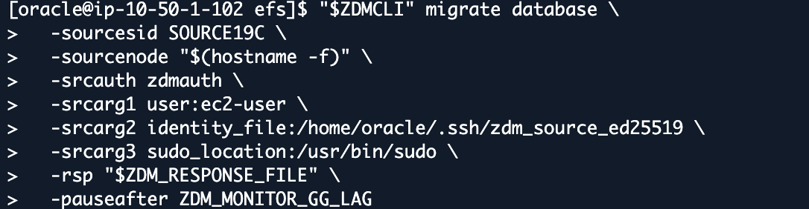

3. Enter the prompted passwords for the source database (`SYSTEM`, `GGADMIN`), target database (`ADMIN`, `GGADMIN`), and GoldenGate hub (`oggadmin`) from your reservation information. Password input is not displayed. Record the migration job ID printed by ZDM; use this ID throughout the remaining steps.

    

4. Replace `<JOB_ID>` (including the brackets) with the migration job ID printed in the previous step, then run the command. Use that same ID wherever `<JOB_ID>` appears below, including filenames. Do not use the evaluation job ID. The screenshot's ID is only an example.

    ```bash
    <copy>
    "$ZDMCLI" query job -jobid <JOB_ID>
    </copy>
    ```

## Task 2: Monitor the ZDM Initial Load and GoldenGate Replication

ZDM first coordinates the initial Data Pump load, then monitors GoldenGate replication. The `-pauseafter ZDM_MONITOR_GG_LAG` option tells ZDM where to pause. Monitor your migration job until its status is `PAUSED` at that checkpoint.

1. Run this query in the `oracle` shell to check progress. Repeat the query, not the migration submission.

    ```bash
    <copy>
    "$ZDMCLI" query job -jobid <JOB_ID>
    </copy>
    ```

2. Confirm that the job reaches these milestones in order:

    - Source database, target database, GoldenGate hub, and Data Pump validation.
    - GoldenGate source database preparation and Extract creation.
    - Data Pump export from the source database to Amazon EFS, the Amazon EFS transfer phase, and import into the target database.
    - Replicat creation/start and lag monitoring.
    - Job `PAUSED` after `ZDM_MONITOR_GG_LAG` completes.

    The paused state is intentional. Extract and Replicat should be running at this checkpoint. Check their reported state and heartbeat lag. Zero throughput can mean an idle source; it does not by itself indicate failure.

    Example phase output showing completed Data Pump export/import, GoldenGate Replicat startup, and lag monitoring. Confirm `PAUSED` separately in your job's status before the replication test.

    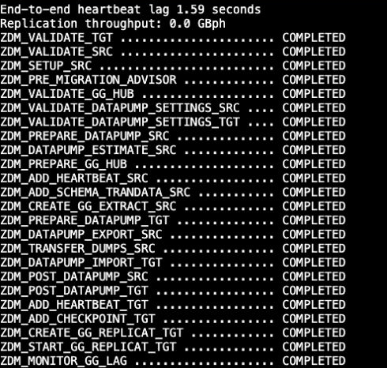

## Task 3: Verify GoldenGate INSERT, UPDATE, and DELETE Replication

Run only while the migration is paused after lag monitoring, before cutover. Use the three test rows below. Run the INSERT, UPDATE, and DELETE statements only on the source database, never on the target database.

1. Load the source database environment variables in the `oracle` shell.

    ```bash
    <copy>
    source "$HOME/env/source19c.env"
    </copy>
    ```

2. Connect to the source database using SQL*Plus as `SYSDBA` from the `oracle` shell.

    ```bash
    <copy>
    sqlplus / as sysdba
    </copy>
    ```

3. At the source database `SQL>` prompt, inspect the table structure.

    ```sql
    <copy>
    DESC finance.accounts
    </copy>
    ```

    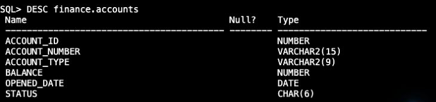

4. Check that the demonstration IDs are unused.

    ```sql
    <copy>
    SELECT account_id, account_number, balance, status
    FROM finance.accounts
    WHERE account_id IN (99000101,99000102,99000103)
    ORDER BY account_id;
    </copy>
    ```

    Continue only if this returns `no rows selected`. If any ID exists, stop.

    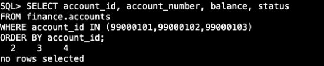

5. Insert the three demonstration rows.

    ```sql
    <copy>
    INSERT INTO finance.accounts
      (account_id, account_number, account_type, balance, opened_date, status)
    VALUES
      (99000101, 'ZDM-ONLINE-101', 'CHECKING', 1001.01, SYSDATE, 'ACTIVE');

    INSERT INTO finance.accounts
      (account_id, account_number, account_type, balance, opened_date, status)
    VALUES
      (99000102, 'ZDM-ONLINE-102', 'SAVINGS', 1002.02, SYSDATE, 'ACTIVE');

    INSERT INTO finance.accounts
      (account_id, account_number, account_type, balance, opened_date, status)
    VALUES
      (99000103, 'ZDM-ONLINE-103', 'CREDIT', 1003.03, SYSDATE, 'ACTIVE');
    </copy>
    ```

    Expect three `1 row created.` responses.

    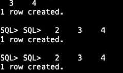

6. Require three successful inserts. If any statement fails, run `ROLLBACK;` and stop. Update the first row using the six-character status `ZDMUPD`, which fits the lab's `STATUS` column.

    ```sql
    <copy>
    UPDATE finance.accounts
    SET balance = 7777.77, status = 'ZDMUPD'
    WHERE account_id = 99000101;
    </copy>
    ```

    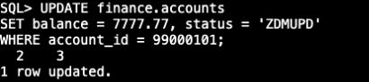

7. Expect one row updated. Delete the second demonstration row.

    ```sql
    <copy>
    DELETE FROM finance.accounts WHERE account_id = 99000102;
    </copy>
    ```

    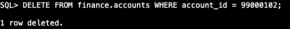

8. Expect one row deleted. Commit the changes.

    ```sql
    <copy>
    COMMIT;
    </copy>
    ```

    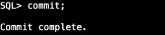

9. Record the committed source database results.

    ```sql
    <copy>
    SELECT account_id, account_number, balance, status
    FROM finance.accounts
    WHERE account_id IN (99000101,99000102,99000103)
    ORDER BY account_id;
    </copy>
    ```

    Expect ID `99000101` with balance `7777.77` and status `ZDMUPD`, and ID `99000103` with balance `1003.03` and status `ACTIVE`. ID `99000102` must be absent.

    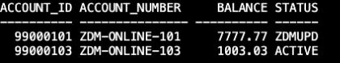

10. Exit SQL*Plus to return to the `oracle` shell.

    ```sql
    <copy>
    EXIT
    </copy>
    ```

11. Load the target database environment variables in the `oracle` shell.

    ```bash
    <copy>
    source "$HOME/env/adbs.env"
    </copy>
    ```

12. Connect to the target database as `ADMIN`. Enter **Target ADMIN Password** from your reservation information when prompted.

    ```bash
    <copy>
    sqlplus -L ADMIN@"$TARGET_ALIAS"
    </copy>
    ```

13. At the target database `SQL>` prompt, query the same rows.

    ```sql
    <copy>
    SET LINESIZE 220
    SELECT account_id, account_number, balance, status
    FROM finance.accounts
    WHERE account_id IN (99000101,99000102,99000103)
    ORDER BY account_id;
    </copy>
    ```

    Repeat this SELECT until it matches the committed source database results. Replication is asynchronous. Do not write to the target database or rerun the source database inserts. Resolve any mismatch before cutover.

    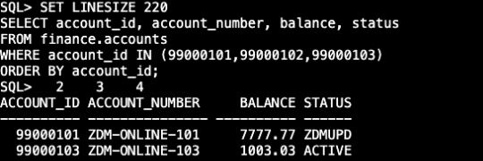

14. Exit SQL*Plus to return to the `oracle` shell.

    ```sql
    <copy>
    EXIT
    </copy>
    ```

## Task 4: Resume the ZDM Job for Cutover

1. Stop all source application writes and finish or roll back outstanding transactions **before** resuming. In this lab, stop the DML test and any workload generator. Do not stop the database, listener, or GoldenGate manually.

2. Load the ZDM environment variables in the `oracle` shell.

    ```bash
    <copy>
    source /etc/profile.d/zdm26.sh
    export ZDMCLI="$ZDM_HOME/bin/zdmcli"
    </copy>
    ```

3. Confirm the same migration job is paused at the expected phase.

    ```bash
    <copy>
    "$ZDMCLI" query job -jobid <JOB_ID>
    </copy>
    ```

4. After the replication test passes, resume the job once.

    ```bash
    <copy>
    "$ZDMCLI" resume job -jobid <JOB_ID>
    </copy>
    ```

5. Repeat this query until the job reports `SUCCEEDED`.

    ```bash
    <copy>
    "$ZDMCLI" query job -jobid <JOB_ID>
    </copy>
    ```

    Do not run `migrate database` again. A resumed job retains its job ID. If disconnected, reconnect, load the environment from Task 1, enter the existing job ID, and query it. Keep source writes stopped after cutover.

    Example output while cutover is in progress: `ZDM_PREPARE_SWITCHOVER_APP` is `STARTED`, and later phases are `PENDING`. Continue checking until your job reports `SUCCEEDED`.

    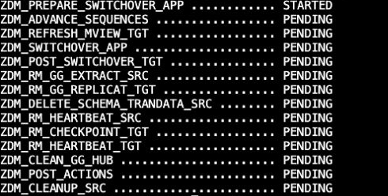

    When migration finishes, the query reports `Current status: SUCCEEDED`. Your job ID and execution times will differ from this example.

    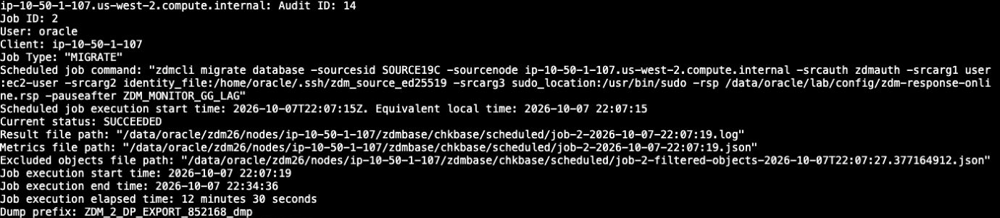

## Task 5: Validate the Migration and Save the ZDM Results

1. After the migration reports `SUCCEEDED`, load the target database environment variables in the `oracle` shell.

    ```bash
    <copy>
    source "$HOME/env/adbs.env"
    </copy>
    ```

2. Run the validation script and enter the target ADMIN password from your reservation information.

    ```bash
    <copy>
    "$ORACLE_HOME/bin/sqlplus" -L ADMIN@"$TARGET_ALIAS" \
      @/data/oracle/lab/config/validate-zdm-accounts.sql
    </copy>
    ```

    Example target validation output. `ACCOUNTS_ROW_COUNT` is the current row count; `NUM_ROWS` comes from table statistics and can differ. Your counts depend on your initial data and committed changes.

    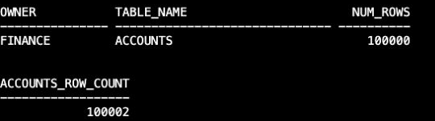

3. Load ZDM to save the final report using the same migration job ID recorded in Task 1.

    ```bash
    <copy>
    source /etc/profile.d/zdm26.sh
    export ZDMCLI="$ZDM_HOME/bin/zdmcli"
    </copy>
    ```

4. Write the final ZDM job report to your home directory. Replace both occurrences of `<JOB_ID>` with your migration job ID.

    ```bash
    <copy>
    "$ZDMCLI" query job -jobid <JOB_ID> \
      | tee "$HOME/zdm-job-<JOB_ID>-final.txt"
    </copy>
    ```

5. Record Lab ID, evaluation/migration job IDs, start/end times, phase statuses, sanitized response file, CPAT/excluded-object reports, Data Pump logs, replication metrics, and source/target validation results. Obtain paths from your job rather than copying prototype paths.

    Do not upload passwords, private SSH keys, wallet contents, or unsanitized environment files. Participants do not delete shared infrastructure or rerun fleet provisioning.

## Acknowledgements

* **Author** - Arnab Saha, Principal Solutions Architect, OCI Multicloud
* **Author** - Vineet Agarwal, Senior Principal Solutions Architect, OCI Multicloud
* **Last Updated By/Date** - Arnab Saha and Vineet Agarwal / October 8, 2026
