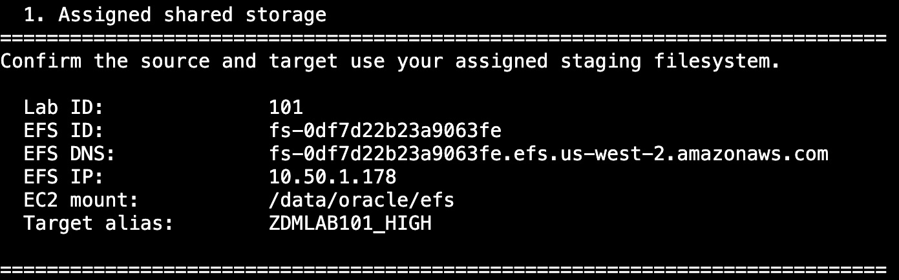
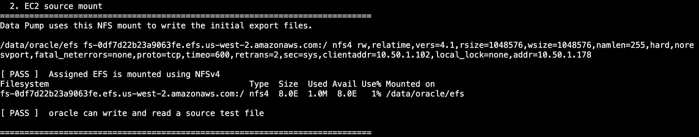
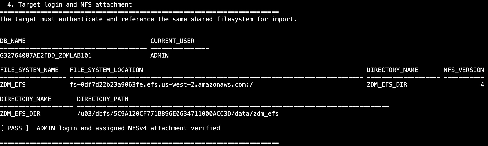
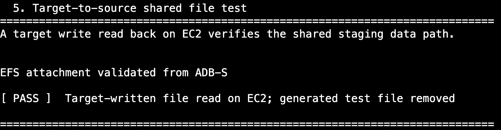
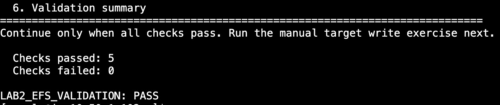
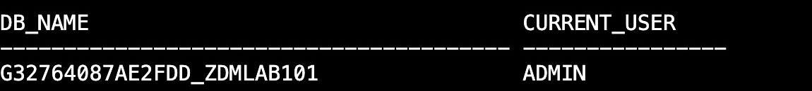
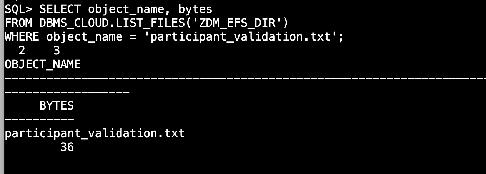
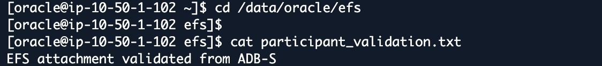

# Lab 2: Verify Shared Amazon EFS NFS Staging

## Introduction

Validate shared Amazon EFS storage from EC2 and Autonomous AI Database. On the source, inspect the default `DATA_PUMP_DIR` and the EFS staging directory `EFS_DP_DIR`. On the target, validate the `ZDM_EFS_DIR` attachment. The source mount and target attachment must access the same Amazon EFS filesystem over NFSv4.

Estimated Time: 15 minutes

### Objectives

- Run the shared-storage validation script.
- Review the source mount, target attachment, and shared-file results.
- Connect to the target from EC2 and verify a file write through SQL*Plus.

## Task 1: Run the Shared Storage Readiness Check

1. In the AWS console, select **US West (Oregon)** (`us-west-2`). Open **EC2**, select the **EC2 Instance ID** from your reservation, and choose **Connect → Session Manager → Connect**.

2. In the Session Manager shell, switch to `oracle`. If you are already in the `oracle` shell, continue to the next step.

    ```bash
    <copy>
    sudo -iu oracle
    </copy>
    ```

3. Run the script and save its formatted output.

    ```bash
    <copy>
    set -o pipefail
    umask 077
    bash "$HOME/lab2-efs-validation.sh" 2>&1 | tee "$HOME/lab2-efs-validation.log"
    </copy>
    ```

    The script loads your assigned environment and checks the existing mount and attachment. It also creates and removes its own test files. It does not require a password prompt.

4. Review the saved output. Use the arrow keys to scroll and press `q` to return to the shell.

    ```bash
    <copy>
    less -S "$HOME/lab2-efs-validation.log"
    </copy>
    ```

    Continue only when the final result is `LAB2_EFS_VALIDATION: PASS`. If a check fails or times out, stop before starting migration.

## Task 2: Understand the Validation Output

The screenshots show example output. Check your own assigned values and results.

1. **Assigned shared storage.** Confirm your EFS ID, hostname, IP address, mount path, and target alias. These identify the storage that connects the source export and target import.

    

2. **EC2 source mount.** Confirm the assigned EFS is mounted using NFSv4 and that `oracle` can write and read a test file. This verifies the source can create Data Pump export files on shared storage.

    

3. **Source Data Pump directories.** Confirm `DATA_PUMP_DIR` exists and `EFS_DP_DIR` points to `/data/oracle/efs/zdm-lab-gold/datapump`. The default directory is local; the EFS directory identifies shared staging storage.

4. **Target login and NFS attachment.** Confirm the connection uses `ADMIN`, and `ZDM_EFS_DIR` references the assigned EFS with NFS version `4`. This verifies the target can authenticate and has the correct staging attachment.

    

5. **Target-to-source shared file test.** Confirm the target-written file is read successfully on EC2. This verifies that both databases use the same storage path; the script removes its generated test file afterward.

    

6. **Validation summary.** Require `5` passed checks, `0` failed checks, and `LAB2_EFS_VALIDATION: PASS` before continuing.

    

## Task 3: Validate a Target Write from EC2

1. In the `oracle` EC2 shell, load the source and target connection environments.

    ```bash
    <copy>
    source "$HOME/env/source19c.env"
    source /data/oracle/lab/config/lab-env.sh
    source "$HOME/env/adbs.env"
    </copy>
    ```

2. Connect to the target. At the password prompt, enter **Target ADMIN Password** from your reservation information.

    ```bash
    <copy>
    sqlplus -L "ADMIN@$TARGET_ALIAS"
    </copy>
    ```

3. Confirm the target database and connected user.

    ```sql
    <copy>
    SET LINESIZE 160
    SET PAGESIZE 100
    COLUMN db_name FORMAT A40
    COLUMN current_user FORMAT A16
    SELECT SYS_CONTEXT('USERENV','DB_NAME') AS db_name,
           SYS_CONTEXT('USERENV','CURRENT_USER') AS current_user
    FROM dual;
    </copy>
    ```

    Confirm that the database matches your assigned target and the user is `ADMIN`.

    

4. Check the target attachment.

    ```sql
    <copy>
    COLUMN file_system_name FORMAT A18
    COLUMN file_system_location FORMAT A65
    COLUMN directory_name FORMAT A20
    SELECT file_system_name, file_system_location, directory_name, nfs_version
    FROM dba_cloud_file_systems
    WHERE directory_name = 'ZDM_EFS_DIR';
    </copy>
    ```

    Match the filesystem location to the EFS hostname shown in Task 2. Confirm the directory is `ZDM_EFS_DIR` and NFS version is `4`.

    

5. Write a validation file from the target database. This replaces only `participant_validation.txt` if that test file already exists.

    ```sql
    <copy>
    DECLARE
      f UTL_FILE.FILE_TYPE;
    BEGIN
      f := UTL_FILE.FOPEN('ZDM_EFS_DIR', 'participant_validation.txt', 'w');
      UTL_FILE.PUT_LINE(f, 'EFS attachment validated from ADB-S');
      UTL_FILE.FCLOSE(f);
    EXCEPTION WHEN OTHERS THEN
      IF UTL_FILE.IS_OPEN(f) THEN UTL_FILE.FCLOSE(f); END IF;
      RAISE;
    END;
    /
    </copy>
    ```

    Require `PL/SQL procedure successfully completed`.

    

6. Confirm the file is visible from the target.

    ```sql
    <copy>
    SELECT object_name, bytes
    FROM DBMS_CLOUD.LIST_FILES('ZDM_EFS_DIR')
    WHERE object_name = 'participant_validation.txt';
    </copy>
    ```

    Expect one row for `participant_validation.txt` with a nonzero byte count.

    

7. Exit SQL*Plus to return to the `oracle` EC2 shell.

    ```sql
    <copy>
    EXIT
    </copy>
    ```

8. Read the target-written file from the source mount.

    ```bash
    <copy>
    cat "$EFS_MOUNT_POINT/participant_validation.txt"
    </copy>
    ```

    Expect `EFS attachment validated from ADB-S`. This confirms a target database write is visible on EC2 through the shared EFS filesystem. Leave this validation file in place. Stop if the write or read fails or hangs.

    

## Acknowledgements

* **Author** - Arnab Saha, Principal Solutions Architect, OCI Multicloud
* **Author** - Vineet Agarwal, Senior Principal Solutions Architect, OCI Multicloud
* **Last Updated By/Date** - Arnab Saha and Vineet Agarwal / October 7, 2026
