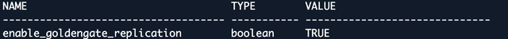
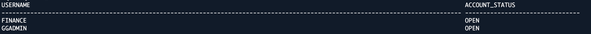
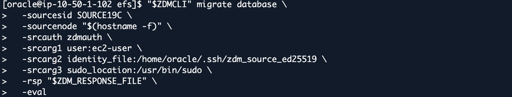
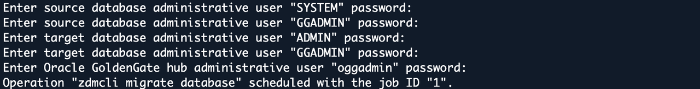
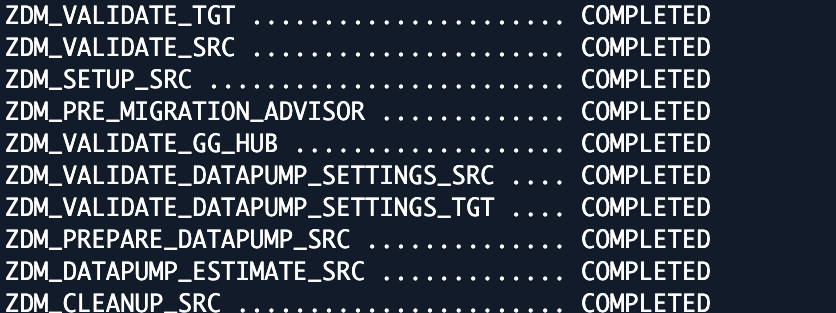

# Lab 3: Review and Evaluate the Online ZDM Migration

## Introduction

Review the ZDM response file and GoldenGate preparation in your environment, then run the ZDM evaluation process. ZDM coordinates the initial Data Pump transfer and GoldenGate replication. Evaluation checks readiness but does not perform the full export/import or prove end-to-end replication.

The ZDM response file contains your migration settings: the source database and target database connections, the table to migrate, Amazon EFS storage, and the GoldenGate configuration. ZDM reads this file during evaluation and migration so it uses the correct resources and migration method.

Estimated Time: 20 minutes

### Objectives

Review the ZDM and GoldenGate configuration, confirm target database readiness, and complete the ZDM evaluation process.

## Task 1: Review the ZDM and GoldenGate Configuration

1. Continue in the `oracle` shell and load your environment variables. If you reconnected through Session Manager as `ssm-user`, run `sudo -iu oracle` first.

    ```bash
    <copy>
    source "$HOME/env/source19c.env"
    source /etc/profile.d/zdm26.sh
    source /data/oracle/lab/config/lab-env.sh
    export ZDMCLI="$ZDM_HOME/bin/zdmcli"
    export ZDM_SOURCE_SSH_KEY="$HOME/.ssh/zdm_source_ed25519"
    </copy>
    ```

2. Display the ZDM migration method, included object, GoldenGate deployment names, and target database service.

    ```bash
    <copy>
    grep -E '^(MIGRATION_METHOD|DATA_TRANSFER_MEDIUM|INCLUDEOBJECTS-1|GOLDENGATEHUB_(SOURCE|TARGET)DEPLOYMENTNAME|TARGETDATABASE_CONNECTIONDETAILS_SERVICENAME)=' "$ZDM_RESPONSE_FILE"
    </copy>
    ```

3. Check your output and confirm the following required settings in the response file:

    - `MIGRATION_METHOD=ONLINE_LOGICAL` and `DATA_TRANSFER_MEDIUM=NFS`. Keep the literal value `NFS`: ZDM uses it for the protocol through which it accesses Amazon EFS.
    - Only `FINANCE.ACCOUNTS` included in TABLE mode.
    - Source database users `SYSTEM` and `GGADMIN`; target database users `ADMIN` and `GGADMIN`; GoldenGate hub user `oggadmin`.
    - Case-sensitive `Local` for both deployment names.
    - Source database host reachable from the GoldenGate container.
    - Target database ZDM wallet alias on port 1522.
    - Source database directory `DATA_PUMP_DIR_NFS`, target database directory `ZDM_EFS_DIR`, assigned Amazon EFS hostname, and retained Amazon EFS storage. Preserve these directory object names exactly as configured.
    - Approved lag, DDL, performance, and dump-retention settings unchanged.

    The validator compares the generated file with the approved template after assignment substitutions. Do not add tablespace remapping, change usernames, or loosen TLS settings to bypass a failure.

4. Run the response-file validator in the `oracle` shell.

    ```bash
    <copy>
    /data/oracle/lab/bin/validate-zdm-response.sh
    </copy>
    ```

    

    The screenshots show sample output from the command above. `ZDM_RESPONSE_VALID` is the success marker.

    

## Task 2: Confirm the ZDM and GoldenGate Target Database Preparation

The target database accounts are already prepared. The target database TLS wallet is already installed for ZDM. ZDM prompts for credentials at runtime; SQL*Plus uses the password-authenticated alias from `adbs.env`.

1. From the `oracle` shell, check connectivity to the assigned target database.

    ```bash
    <copy>
    source "$HOME/env/adbs.env"
    "$ORACLE_HOME/bin/tnsping" "$TARGET_ALIAS"
    </copy>
    ```

2. Connect to the target database as `ADMIN`.

    ```bash
    <copy>
    sqlplus -L ADMIN@"$TARGET_ALIAS"
    </copy>
    ```

3. Enter **Target ADMIN Password** from your reservation information when prompted. Check the target database state and GoldenGate replication setting.

    ```sql
    <copy>
    SET LINESIZE 220
    SET PAGESIZE 100
    SELECT name, open_mode FROM v$database;
    SHOW PARAMETER enable_goldengate_replication
    </copy>
    ```

    Confirm the target database is `READ WRITE` and `enable_goldengate_replication` is `TRUE`. The screenshot shows the replication setting.

    

4. Check the target database users and their account status.

    ```sql
    <copy>
    SELECT username, account_status FROM dba_users
    WHERE username IN ('GGADMIN','FINANCE') ORDER BY username;
    </copy>
    ```

    Confirm both `GGADMIN` and `FINANCE` are `OPEN`. GoldenGate uses `GGADMIN` for the target replication connection; `FINANCE` owns the migrated table.

    

5. Check that the target database `FINANCE` schema does not contain an `ACCOUNTS` table before the first migration.

    ```sql
    <copy>
    SELECT owner, table_name FROM dba_tables
    WHERE owner='FINANCE' AND table_name='ACCOUNTS';
    </copy>
    ```

    Expect `no rows selected` for a fresh target database. If a row is returned, resolve the target database assignment or migration-history issue before evaluation. Do not drop the table to force a rerun.

6. Exit SQL*Plus to return to the `oracle` shell.

    ```sql
    <copy>
    EXIT
    </copy>
    ```

## Task 3: Run the ZDM Evaluation Process

1. Back at the `oracle` shell, reload the source database environment variables after the target database SQL check.

    ```bash
    <copy>
    source "$HOME/env/source19c.env"
    source /etc/profile.d/zdm26.sh
    source /data/oracle/lab/config/lab-env.sh
    export ZDMCLI="$ZDM_HOME/bin/zdmcli"
    export ZDM_SOURCE_SSH_KEY="$HOME/.ssh/zdm_source_ed25519"
    </copy>
    ```

2. Submit the ZDM evaluation from the `oracle` shell to check the source database, target database, Data Pump settings, and GoldenGate hub readiness.

    ```bash
    <copy>
    "$ZDMCLI" migrate database \
      -sourcesid "$ORACLE_SID" \
      -sourcenode "$(hostname -f)" \
      -srcauth zdmauth \
      -srcarg1 user:ec2-user \
      -srcarg2 "identity_file:$ZDM_SOURCE_SSH_KEY" \
      -srcarg3 sudo_location:/usr/bin/sudo \
      -rsp "$ZDM_RESPONSE_FILE" \
      -eval
    </copy>
    ```

    

3. Enter the prompted passwords for the source database (`SYSTEM`, `GGADMIN`), target database (`ADMIN`, `GGADMIN`), and GoldenGate hub (`oggadmin`) from the corresponding fields in your reservation information. Password input is not displayed.

    

    ZDM prints the job ID when it schedules your evaluation. Record this ID: it identifies your evaluation and is important for monitoring its progress and locating its results. Your ID may differ from the screenshot.

4. Replace `<JOB_ID>` (including the brackets) with the job ID printed in the previous step, then run the command to check the evaluation status. Run it again to see updated progress.

    ```bash
    <copy>
    "$ZDMCLI" query job -jobid <JOB_ID>
    </copy>
    ```

    

5. Proceed only when your selected evaluation job reports `SUCCEEDED`. Review CPAT findings and the excluded-objects file: ACCOUNTS must not be excluded from the required migration/replication scope. Save the actual result-log path from your output.

    Completed prerequisite phases from the same evaluation:

    

    This example is job type `EVAL`, not the actual migration. It does not prove Data Pump import or GoldenGate replication has completed.

    For failures, report the first failed phase and the corresponding log error. Do not skip validation or submit repeated migration jobs.

## Acknowledgements

* **Author** - Arnab Saha, Principal Solutions Architect, OCI Multicloud
* **Author** - Vineet Agarwal, Senior Principal Solutions Architect, OCI Multicloud
* **Last Updated By/Date** - Arnab Saha and Vineet Agarwal / October 8, 2026
